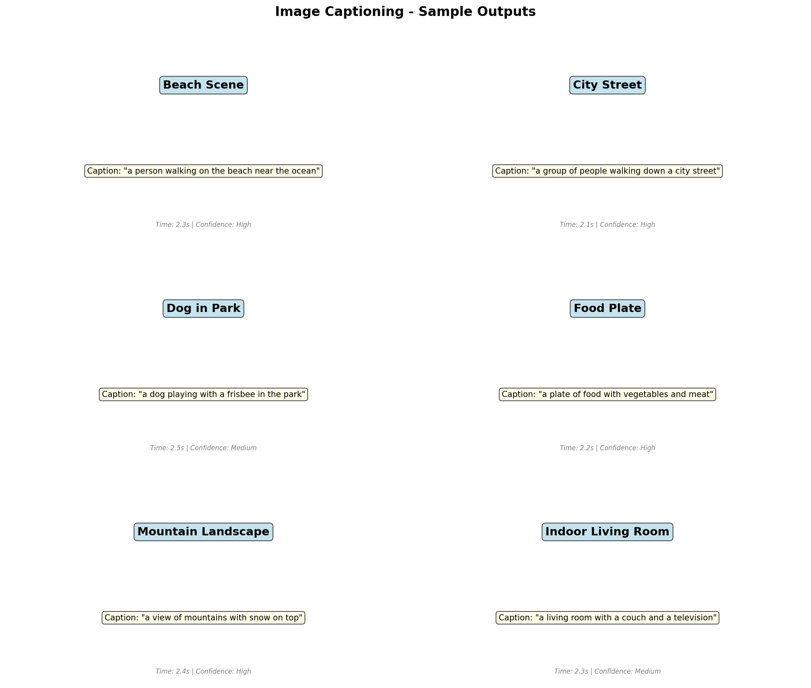

# 🌍 Multilingual Image Captioning with AI

[](https://www.python.org/downloads/)
[](https://pytorch.org/)
[](LICENSE)

**AI-Powered Image Captioning in 25+ Languages with Natural Voice Output**

Generate accurate, descriptive captions for any image with automatic text detection, language recognition, and natural-sounding voice output in multiple languages including Hindi, Tamil, Telugu, Bengali, Spanish, French, Chinese, Japanese, and more!



---

## ✨ Features

### 🖼️ Smart Image Understanding
- **Visual Analysis**: Powered by Salesforce BLIP AI model
- **Text Detection (OCR)**: Reads quotes, signs, labels, and text in images
- **Combined Captions**: Merges visual description with detected text

### 🌐 Multilingual Support (25+ Languages)
- **Indian Languages**: Hindi, Tamil, Telugu, Bengali, Kannada, Malayalam, Marathi, Gujarati, Punjabi
- **European Languages**: English, Spanish, French, German, Italian, Portuguese, Russian, Dutch
- **Asian Languages**: Chinese, Japanese, Korean, Thai, Vietnamese, Indonesian
- **Middle Eastern**: Arabic, Turkish, Hebrew

### 🔄 Auto Detection
- **Auto Language Detection**: Automatically detects language from text in images
- **Smart Voice Selection**: Uses appropriate voice for detected language

### 🎙️ Natural Voice Output
- **15+ Neural Voices**: Human-like text-to-speech
- **Regional Voices**: Native speakers for each language
- **Customizable**: Choose your preferred voice

### 🌐 Web Interface
- **Beautiful UI**: Modern Gradio-based interface
- **Easy Upload**: Drag & drop, clipboard paste, or webcam
- **Real-time**: Instant caption generation

---

## 🚀 Quick Start

### Windows (Recommended)

```batch
# 1. Clone or download the project
# 2. Double-click install.bat
# 3. Double-click run.bat
# 4. Open http://localhost:7860 in your browser
```

### Manual Installation

```bash
# Install dependencies
pip install -r requirements.txt

# Run the app
python app_blip.py

# Open http://localhost:7860
```

---

## 📋 Requirements

### System Requirements
- **OS**: Windows 10/11, macOS, or Linux
- **Python**: 3.10 or higher
- **RAM**: 8GB minimum (16GB recommended)
- **Storage**: 5GB free space (for models)
- **Internet**: Required for first-time model download

### Python Dependencies
All dependencies are listed in `requirements.txt`. Key packages:
- `torch` - PyTorch for AI models
- `transformers` - Hugging Face for BLIP model
- `gradio` - Web interface
- `edge-tts` - Natural voice synthesis
- `easyocr` - Text detection in images
- `deep-translator` - Multi-language translation

---

## 📥 Installation

### Option 1: Automated (Windows)

1. **Download** the project
2. **Run** `install.bat` (double-click)
3. **Wait** for installation to complete
4. **Run** `run.bat` to start the app

### Option 2: Manual Installation

```bash
# Step 1: Install Python dependencies
pip install torch torchvision --index-url https://download.pytorch.org/whl/cpu
pip install -r requirements.txt

# Step 2: Download NLTK data (required for text processing)
python -c "import nltk; nltk.download('punkt')"

# Step 3: Run the application
python app_blip.py
```

### Option 3: Command Line

```bash
# Install everything in one command
pip install torch torchvision transformers gradio edge-tts easyocr deep-translator langdetect pyttsx3 pygame pillow numpy

# Run
python app_blip.py
```

---

## 🎯 Usage

### Web Interface

1. **Open** http://localhost:7860 in your browser
2. **Upload** an image (drag & drop, click, paste, or webcam)
3. **Select** output language or use "Auto Detect"
4. **Choose** caption style (Standard, Detailed, Brief)
5. **Enable** voice output and select voice
6. **Click** "Generate Caption"

### Command Line

```bash
# Basic captioning
python blip_captioner.py --image photo.jpg

# With specific language
python blip_captioner.py --image photo.jpg --language hindi

# With voice output
python blip_captioner.py --image photo.jpg --voice

# Detailed caption
python blip_captioner.py --image photo.jpg --style detailed
```

---

## 🎙️ Available Voices

### English Voices
| Voice | Accent | Style |
|-------|--------|-------|
| Jenny | US | Friendly, conversational |
| Aria | US | Professional |
| Emma | US | Warm, expressive |
| Guy | US | Deep, confident |
| Sonia | UK | Elegant, clear |
| Ryan | UK | Professional |
| Natasha | AU | Warm, natural |

### Indian Language Voices
| Voice | Language |
|-------|----------|
| Swara | Hindi |
| Pallavi | Tamil |
| Shruti | Telugu |
| Tanishaa | Bengali |
| Sapna | Kannada |
| Sobhana | Malayalam |
| Aarohi | Marathi |
| Dhwani | Gujarati |

### International Voices
| Voice | Language |
|-------|----------|
| Xiaoxiao | Chinese |
| Nanami | Japanese |
| SunHi | Korean |
| Elvira | Spanish |
| Denise | French |
| Katja | German |
| Zariyah | Arabic |

---

## 📁 Project Structure

```
Image-Captioning/
├── app_blip.py              # Main web application
├── blip_captioner.py        # CLI captioning tool
├── model.py                 # Original CNN-RNN model
├── vocabulary.py            # Vocabulary builder
├── requirements.txt         # Python dependencies
├── install.bat              # Windows installer
├── run.bat                  # Windows launcher
├── INSTALL.md               # Detailed installation guide
├── README.md                # This file
└── data/
    └── vocab.pkl            # Vocabulary file
```

---

## ⚙️ Configuration

### Caption Styles

| Style | Description | Best For |
|-------|-------------|----------|
| **Standard** | Balanced, natural captions | General use |
| **Detailed** | Comprehensive descriptions | Documentation |
| **Brief** | Short, concise captions | Quick overview |

### Options

| Option | Default | Description |
|--------|---------|-------------|
| 🎙️ Speak Caption | ✅ On | Voice output |
| 📝 Detect Text | ✅ On | OCR for text in images |
| 🔄 Auto Detect | ✅ On | Auto language detection |
| 📝 Show English | ✅ On | Show English translation |

---

## 🔧 Troubleshooting

### Common Issues

**1. "Module not found" error**
```bash
pip install <module_name>
```

**2. CUDA/GPU errors**
```bash
# Use CPU-only PyTorch
pip uninstall torch torchvision
pip install torch torchvision --index-url https://download.pytorch.org/whl/cpu
```

**3. Model download fails**
- Check internet connection
- Models are downloaded from Hugging Face (~1GB)
- First run takes longer

**4. Voice not working**
```bash
pip install edge-tts pygame --upgrade
```

**5. OCR not detecting text**
```bash
pip install easyocr --upgrade
```

### Performance Tips

- **Faster inference**: Use GPU if available
- **Lower memory**: Use BLIP-base instead of BLIP-large
- **Offline use**: Models are cached after first download

---

## 📊 Performance

| Metric | Value |
|--------|-------|
| Caption Generation | 5-15 seconds (CPU) |
| Text Detection (OCR) | 2-5 seconds |
| Translation | 1-2 seconds |
| Voice Synthesis | 2-3 seconds |
| Total (with voice) | 10-25 seconds |

---

## 🤝 Contributing

Contributions are welcome! Please feel free to submit a Pull Request.

1. Fork the repository
2. Create your feature branch (`git checkout -b feature/AmazingFeature`)
3. Commit your changes (`git commit -m 'Add some AmazingFeature'`)
4. Push to the branch (`git push origin feature/AmazingFeature`)
5. Open a Pull Request

---

## 📄 License

This project is licensed under the MIT License - see the [LICENSE](LICENSE) file for details.

---

## 🙏 Acknowledgments

- **Salesforce BLIP** - Image captioning model
- **Hugging Face** - Transformers library
- **Microsoft Edge TTS** - Natural voice synthesis
- **EasyOCR** - Text detection
- **Gradio** - Web interface

---

## 📚 References

- [BLIP Paper](https://arxiv.org/abs/2201.12086)
- [Hugging Face Transformers](https://huggingface.co/docs/transformers)
- [Gradio Documentation](https://gradio.app/docs/)
- [Edge TTS](https://github.com/rany2/edge-tts)

---

**Made with ❤️ for the multilingual community**

